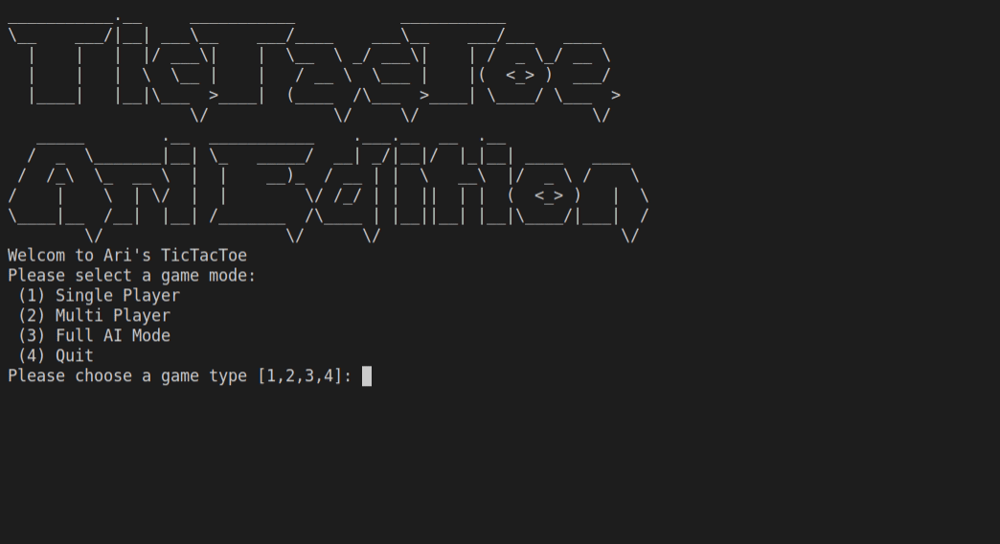
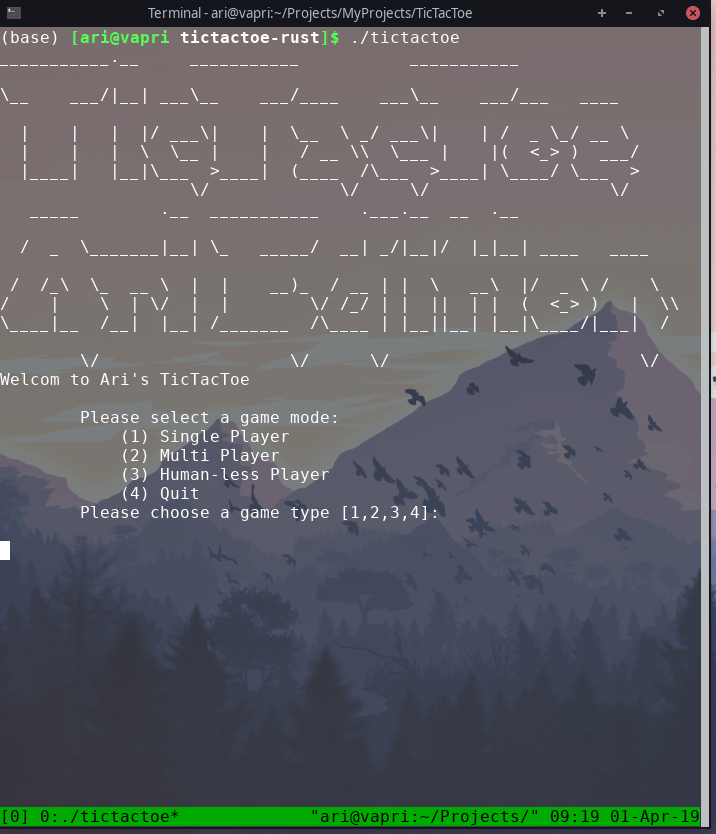
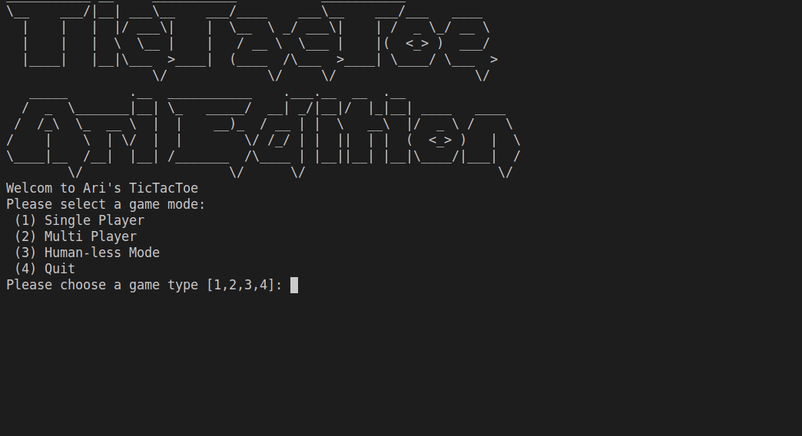

# TicTacToe (Go Version)


## What is this?
This is a simple implementation of a Tic Tac Toe Game in the [go language](https://golang.org/), that you can run in your terminal. For the other versions, see the [Master Branch](https://github.com/asosnovsky/TicTacToe/tree/master#what-is-this).


## Requirments
Nothing, just run the binary (or rebuild with Go)

## Usage
If you are running a unix-based system (linux or mac) then simply run the program as follows:

```sh
./tictactoe
```

Otherwise, in windows download/run the exe file [tictactoe.exe](tictactoe.exe)

## Game Modes

### Single Player


### MultiPlayer


### Human-Less Mode (my favourite)

