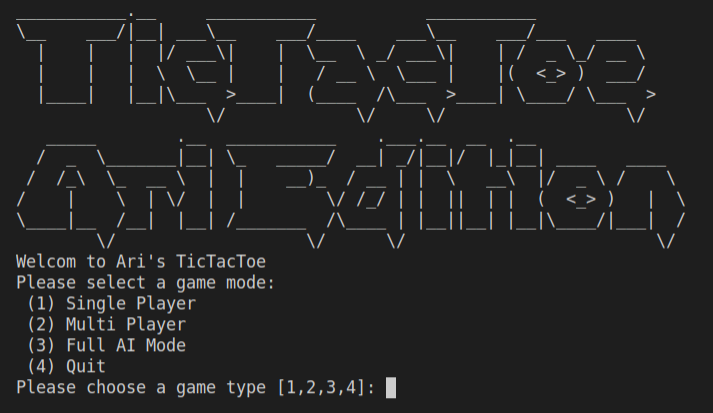

# TicTacToe

## What is this?
This is a simple implementation of a Tic Tac Toe Game in various language. Simply put, I find that learning a language is best done by building a project within it. It is due to this, that I attempt to write a simple tic-tac-toe game in any new language I attempt to pick up.

## Implementations

- Python Implementation: [link](https://github.com/asosnovsky/TicTacToe/tree/python#tictactoe)
- Go Implementation: [Link](https://github.com/asosnovsky/TicTacToe/tree/go#tictactoe)
- Rust Implementation: [Link](https://github.com/asosnovsky/TicTacToe/tree/rust#tictactoe)
