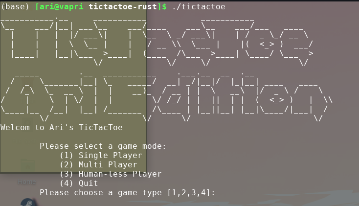

# TicTacToe


## What is this?
This is a simple implementation of a Tic Tac Toe Game in the [python language](https://www.python.org/), that you can run in your terminal. For the other versions, see the [Master Branch](https://github.com/asosnovsky/TicTacToe/tree/master#what-is-this).
## Requirments
 - Python 3.6.4 > 

## Usage
If you are running a unix-based system (linux or mac) and have the main python command mapped to Python 3.6.4 > then simply run the program as follows:

```sh
./tictactoes.py
```

otherwise make sure to use the correct python extension
```sh
python3.6 ./tictactoes.py
```

## Game Modes

### Single Player


### MultiPlayer


### Human-Less Mode (my favourite)

